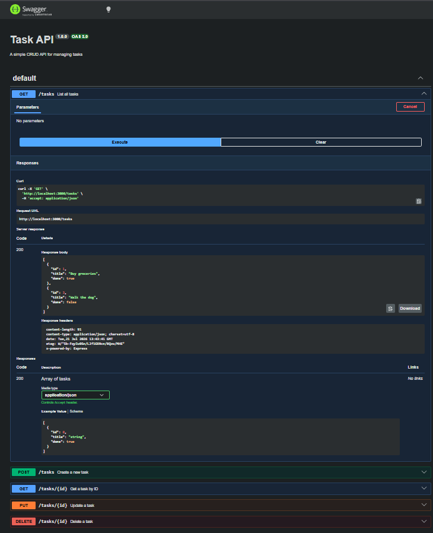

# Task API

A simple CRUD REST API for managing tasks, built with Node.js, Express, and SQLite. Data persists across restarts via a local SQLite database file.

## Install & Run

```bash
npm install
npm start
```

Server runs on `http://localhost:3000`. Interactive API docs available at `http://localhost:3000/docs`.

## Why SQLite?

- **Single file** — the entire database is one `tasks.db` file, no server or config needed.
- **Zero setup** — no Docker, no install, no connection strings. Just run the app.
- **Survives restarts** — unlike in-memory storage, your data persists when the server stops and starts again.
- `tasks.db` is git-ignored and auto-created on first run with 3 seed tasks.

## Endpoints

| Method | Endpoint | Description | Status |
|--------|----------|-------------|--------|
| GET | `/` | API info | 200 |
| GET | `/health` | Health check | 200 |
| GET | `/tasks` | List all tasks | 200 |
| GET | `/tasks/:id` | Get a task by ID | 200 / 404 |
| POST | `/tasks` | Create a task | 201 / 400 |
| PUT | `/tasks/:id` | Update a task | 200 / 400 / 404 |
| DELETE | `/tasks/:id` | Delete a task | 204 / 404 |

## Example Request & Response

```bash
curl -i -X POST http://localhost:3000/tasks -H "Content-Type: application/json" -d '{"title":"Learn SQLite"}'
```

```
HTTP/1.1 201 Created
Content-Type: application/json

{"id":4,"title":"Learn SQLite","done":false}
```

## Inspecting the Database

Open `tasks.db` in [DB Browser for SQLite](https://sqlitebrowser.org/). Example query to run in the Execute SQL tab:

```sql
SELECT * FROM tasks;
```

This returns all tasks with their id, title, and done status (0/1).

<!-- TODO: Add DB Browser screenshot here -->

## Swagger UI

Interactive API documentation is served at `http://localhost:3000/docs`.


